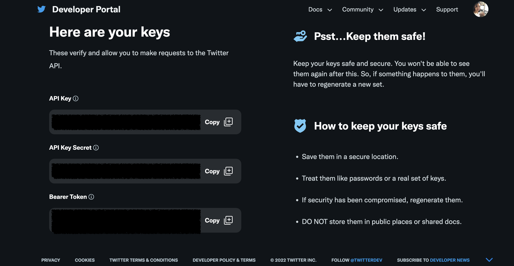

# pac-issue-git-scraping
This project scrapes all the PAC candidates in the FEC database their personal/campaign facebook profile. 

By running a github action workflow defined in [cands-tw-feeds.yml](.github/workflows/cands-tw-feeds.yml) workflow, we will be able to get the data of the candidate

As of Jun 21st 2022, Due to a massive ban of the scrapers and bots of facebook, the scraping project scrapes twitter instead by using a tweepy and an API key. 

I created a tweeter API and a script. The script is written in Python using the tweepy package. Please refer to the  for the scraping script.

Please also check out the references and articles I have gone over that are postentially pertaining to this research project. 

[endnote_references](endnote_references.txt)

sample out file [aaron_lee.csv](aaron_lee.csv)
